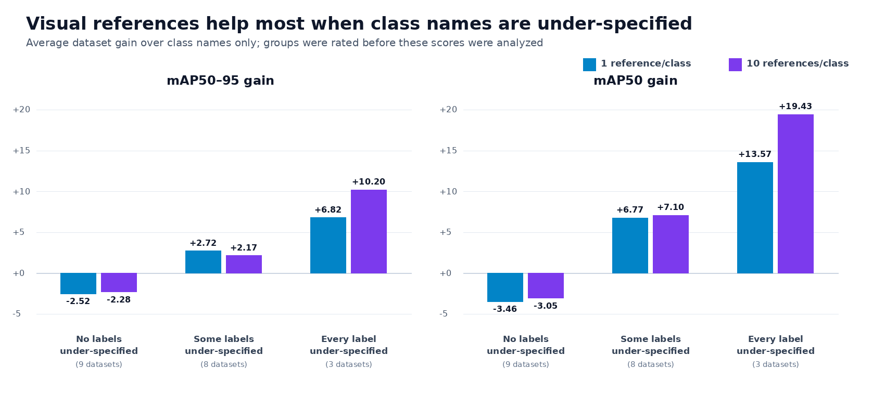

# Qwen3.8-Max uses visual references as dataset adaptation

> **Finding:** Qwen3.8-Max does not benefit reliably from adding more context
> everywhere. Visual references provide substantial, above-noise gains when
> class names under-specify appearance, state, or annotation semantics, but
> offer little benefit and can hurt when names already identify familiar
> objects. Instructions are understood, but visual examples generally transfer
> dataset-specific appearance more effectively.

The practical choices are class names only as the simplest default, one visual
reference per class as the efficient adaptation mode, and ten references per
class as the accuracy-maximizing mode measured here. Ten references achieved
the highest RF20 score, but its small lead over one reference is within the
measured noise proxy and costs about 3.4× as much.

We evaluated one multi-class request per test image on all 20 RF20-VL-FSOD
datasets: 3,970 images, reasoning off, temperature 0, fixed seed, normalized
0–1000 XYXY reference boxes, and COCO `maxDets=500` scoring.

## How to read the scores and noise

Every score pair in this report is `mAP50–95 / mAP50`; higher is better. A
gain is the prompted score minus the class-names-only score on the same
dataset.

Temperature 0 and a fixed seed did not make the hosted API deterministic. We
therefore ran six complete, matched passes on three of the larger datasets and
measured two kinds of run-to-run variation:

| Dataset | Test images | Names-only score noise | One-reference gain noise |
|---|---:|---:|---:|
| Actions | 409 | 0.49 / 1.19 | 0.68 / 2.58 |
| Paper Parts | 500 | 0.95 / 3.87 | 3.01 / 3.86 |
| Defect Detection | 188 | 2.17 / 2.89 | 3.17 / 4.42 |

Each value is a conservative repeatability threshold: the larger of the
observed six-run range and the estimated 95% repeatability limit.
**Names-only score noise** is how much an unchanged baseline moved between
runs. **One-reference gain noise** is how much the measured difference between
the reference and baseline conditions moved; it is the relevant threshold when
judging a reference gain. Across these datasets, that threshold ranged from
**0.68–3.17 mAP50–95** and **2.58–4.42 mAP50**.

These values are a calibration range, not a measured RF20-wide noise floor,
because all 20 datasets were not repeated. The three datasets were initially
selected because they were relatively large and had positive reference gains,
so they establish whether those particular gains repeat, not how often gains
occur. The exact threshold definition and six-run results are in the
[noise study](QWEN38_LARGE_DATASET_NOISE_RESULT.md).

## Complete RF20 result

Scores are dataset-macro `mAP50–95 / mAP50`.

| Context given to Qwen3.8-Max | mAP50–95 | mAP50 | Gain vs. names | List-price estimate for this run* |
|---|---:|---:|---:|---:|
| Class names only | 24.37 | 43.54 | baseline | **$22.28** |
| Annotator instructions | 24.46 | 44.58 | +0.09 / +1.04 | $26.21 |
| 1 positive visual reference/class | 25.35 | 46.73 | +0.98 / +3.19 | $34.20 |
| 10 positive visual references/class | **25.74** | **47.92** | **+1.37 / +4.38** | $116.79 |

<details>
<summary><strong>*How the cost estimates were audited</strong></summary>

These are reproducible list-price estimates, not invoice totals. Each API
response recorded total input tokens, implicit-cache-hit input tokens, and
output tokens. We applied the model-specific rates published for
[Qwen3.8-Max](https://www.qwencloud.com/models/qwen3.8-max): **$2/M uncached
input, $0.25/M implicit-cache input, and $6/M output**.

| Context | Uncached input | Cache-hit input | Output | Calculated estimate |
|---|---:|---:|---:|---:|
| Class names only | 5.333M | 0.004M | 1.936M | $22.28 |
| Annotator instructions | 7.388M | 1.302M | 1.851M | $26.21 |
| 1 visual reference/class | 6.946M | 39.046M | 1.757M | $34.20 |
| 10 visual references/class | 8.695M | 354.710M | 1.788M | $116.79 |

The formula is `(uncached input × $2 + cache-hit input × $0.25 + output ×
$6) / 1M`. The [cache documentation](https://docs.qwencloud.com/developer-guides/text-generation/context-cache)
confirms that `cached_tokens` is part of the reported input-token total, which
is how the calculation treats it.

Actual invoices or future reruns can differ because implicit-cache hits are not
guaranteed, provider prices and promotions can change, and subscription credits
may alter effective spend. The estimate also excludes 31 failed API attempts
across 19,850 condition-image tasks that returned no billable-usage metadata;
most were provider-side image download or content-rejection errors.

Recorded sources: [class names and one reference](qwen38-fsod-runs/rf20-three-way-matched-v1/rf20_summary.json),
[instructions](qwen38-fsod-runs/instruction-study-v2/full-rf20/rf20_summary.json),
and [ten references](qwen38-fsod-runs/rf20-all-available-explicit-sparse-v1/rf20_summary.json).

</details>

Compared with the repeatability range above, instructions are within noise, one
reference is borderline in the RF20 macro, and ten references only approach the
upper end of the proxy range for mAP50. The macro average hides the main
finding: **the direction and size of the effect depend strongly on the
dataset.**



## Who benefited from visual references?

Before the instruction study was scored, we rated each of the 110 class names
using only the label text. A class was marked **under-specified** when its name
alone did not clearly identify the intended visual target or annotation
meaning. The exact 110 ratings and criteria are in the locked
[label-sufficiency file](qwen38-fsod-configs/rf20-label-sufficiency-ratings.json).

The most direct dataset-level comparison is:

| Pre-rated dataset group | Datasets | Instructions | 1 visual reference/class | 10 visual references/class |
|---|---:|---:|---:|---:|
| No class names under-specified | 9 | −2.89 / −4.42 | −2.52 / −3.46 | −2.28 / −3.05 |
| Some class names under-specified | 8 | +2.11 / +4.86 | +2.72 / +6.77 | +2.17 / +7.10 |
| Every class name under-specified | 3 | +3.59 / +7.24 | +6.82 / +13.57 | **+10.20 / +19.43** |

Each cell is the average dataset gain over class names only, not a correlation.
Datasets with no under-specified labels regressed on average. Datasets with a
mixture of sufficient and under-specified labels improved. In the three
datasets where every label was under-specified, ten references produced the
largest observed gain.

The class-level comparison shows the same separation:

| Pre-rated class group | Classes | 1 visual reference | 10 visual references |
|---|---:|---:|---:|
| Name alone is under-specified | 47 | **+6.68 / +12.68** | **+6.57 / +13.88** |
| Name alone is sufficient | 63 | −2.22 / −1.84 | −3.89 / −4.97 |
| Requires state, role, or scene context | 37 | **+8.37 / +13.91** | **+8.76 / +15.16** |
| Does not require state, role, or scene context | 73 | −1.86 / −0.48 | −3.57 / −3.04 |

These are direct average class gains. After resampling complete datasets rather
than treating their classes as independent, the gain for under-specified
classes remained above zero on **both** mAP50–95 and mAP50 with either one or
ten references. The exact mAP50–95 *gap between the two class groups* was less
certain; that does not mean the observed under-specified-class gain was unclear.
The strongest evidence is still for mAP50, suggesting that references improve
recognizing *what* should be detected more consistently than exact localization
at stricter IoU thresholds.

## Where visual adaptation helped

These cards use actual RF20 train and test images. Yellow is one of the boxed
training exemplars in the ten-reference prompt. Each target image is shown with
the same green ground truth and either names-only predictions in pink or
visual-prompt predictions in blue.

<table>
<tr>
<td></td>
<td></td>
</tr>
<tr>
<td></td>
<td></td>
</tr>
<tr>
<td></td>
<td></td>
</tr>
<tr>
<td></td>
<td></td>
</tr>
</table>

The largest dataset-level ten-reference gains align with dataset-specific
concepts: animal age groups **+17.51 / +24.32**, railway defects
**+11.25 / +18.85**, Dreidel states and symbols **+10.71 / +22.26**, document
components **+9.73 / +16.13**, and smoke **+5.06 / +18.90**.

## Where familiar labels were flat or hurt

<table>
<tr>
<td></td>
<td></td>
</tr>
<tr>
<td></td>
<td></td>
</tr>
<tr>
<td></td>
<td></td>
</tr>
</table>

Ten references regressed on digits **−20.57 / −41.40**, thermal-camera objects
**−3.85 / −7.24**, fish and other aquarium animals **−3.32 / −0.34**, and wheat
heads **−3.12 / −4.54**. The corresponding labels already describe recognizable
object identities, leaving less useful ambiguity for an exemplar to resolve.

## The rule is predictive, not absolute

All Elements is the clearest counterexample. Its UI labels can require state or
annotation semantics, yet ten references regressed by **−12.39 / −12.77**.

<p align="center">

</p>

Within datasets containing both simple and under-specified classes, class-name
sufficiency alone did not consistently identify the winning class. The finding
therefore supports **dataset-level routing**, not an automatic per-class rule.

The RF20 macro increases in the order class names → one reference → ten
references, but that ordering is not universal: it holds strictly on only 7/20
datasets for mAP50–95 and 10/20 for mAP50. Ten references are only +0.40 / +1.20
above one reference in the RF20 macro, which is within the measured noise proxy,
despite costing over 3× as much.

This is strong exploratory evidence, not a prospective causal result. The
ratings themselves were assigned without viewing scores, but the hypothesis was
motivated by earlier visual-prompt results. A new semantic-control run is needed
for confirmation.

## What the repeat and instruction controls established

The six matched passes confirmed that one-reference gains were much larger than
run-to-run variation on Paper Parts and Actions. Defect Detection stayed
positive, but its one-reference gain remained within the paired-gain noise
threshold shown at the beginning of this report.

| Dataset | Six-run mean one-reference gain | Paired-gain noise | Judgment |
|---|---:|---:|---|
| Actions | +2.22 / +4.98 | 0.68 / 2.58 | **Clearly above noise** |
| Paper Parts | +13.43 / +20.07 | 3.01 / 3.86 | **Clearly above noise** |
| Defect Detection | +2.03 / +3.60 | 3.17 / 4.42 | Within noise |

Instructions are not ignored. In a six-dataset control, the correct
dataset-specific instructions beat instructions shuffled from other classes by
**+4.38 / +8.25**. The model was therefore using their content, not merely
reacting to a longer prompt. However, correct instructions still scored
**−2.97 / −4.13** below class names alone on this matched subset, so they were
not a reliable universal addition.

<details>
<summary><strong>All six-dataset instruction-control scores</strong></summary>

| Six-dataset matched arm | mAP50–95 | mAP50 |
|---|---:|---:|
| Class names only | **22.92** | **42.74** |
| Correct instructions | 19.95 | 38.61 |
| 1 visual reference | 21.62 | 40.73 |
| Instructions + 1 visual reference | 19.33 | 37.44 |
| Conservative shuffled instructions | 19.91 | 38.77 |
| Strictly shuffled instructions | 15.57 | 30.36 |

The strict shuffled arm had 12 terminal model-output failures, but correct
instructions still beat it by **+4.48 / +8.47** after excluding Actions, which
contained 10 of those failures.

</details>

For under-specified classes, the gain from ten visual references exceeded the
gain from instructions by **+5.79 / +10.43**. For classes requiring state or
scene context, the advantage was **+7.21 / +11.28**. Both differences remained
above zero after accounting for classes sharing a dataset. One reference showed
the same direction, but that comparison was still within uncertainty.

## Three practical modes

The results support three increasingly expansive modes:

1. **Class names only:** the cheapest, simplest default at **24.37 / 43.54**.
2. **One boxed visual reference per class:** the best accuracy-cost tradeoff for
   opaque, state-dependent, or visually dataset-specific tasks, at **25.35 /
   46.73**.
3. **Ten boxed visual references per class:** the highest measured RF20 score at
   **25.74 / 47.92**, and the largest observed gain when every class name in a
   dataset was under-specified. This is the accuracy-maximizing mode measured
   here, but its +0.40 / +1.20 lead over one reference is within the noise proxy
   and costs about 3.4× as much.

Therefore, ten references should be described as the **highest observed score**,
not as reliably superior to one reference. Label sufficiency is a useful
dataset-level routing signal, not a guarantee. Instructions remain useful as a
separate research result, but they are not one of the recommended deployment
modes. The clean prospective confirmation is a matched correct-reference versus
class-shuffled-reference control using the already locked sufficiency ratings.

<details>
<summary><strong>All 20 per-dataset deltas versus class names only</strong></summary>

Each cell is `mAP50–95 / mAP50`.

| Dataset | Instructions | 1 visual | 10 visual |
|---|---:|---:|---:|
| Actions | +0.83 / +0.96 | +2.11 / +3.55 | +2.02 / +4.57 |
| Aerial Airport | −3.95 / −7.69 | −0.14 / −2.01 | +3.41 / +2.06 |
| All Elements | −6.47 / −0.47 | −7.59 / −0.65 | −12.39 / −12.77 |
| Aquarium Combined | −2.93 / −2.02 | −3.14 / −0.42 | −3.32 / −0.34 |
| Defect Detection | +8.60 / +13.22 | +4.16 / +6.35 | +11.25 / +18.85 |
| DentalAI | −0.65 / −1.95 | +0.45 / +1.04 | +0.28 / +0.85 |
| FLIR Camera Objects | −1.84 / −4.71 | +0.12 / −1.68 | −3.85 / −7.24 |
| Global Wheat Head | −3.56 / −4.33 | −2.69 / −3.64 | −3.12 / −4.54 |
| Lacrosse Object Detection | +1.46 / +2.93 | +0.55 / +4.18 | −0.49 / +5.75 |
| New Defects in Wood | +1.90 / +7.35 | +1.63 / +3.84 | +1.22 / +4.54 |
| Orion Products | +0.51 / +7.88 | +3.97 / +18.25 | +1.84 / +15.11 |
| Paper Parts | −0.50 / −0.04 | +13.60 / +19.25 | +9.73 / +16.13 |
| Recode Waste | +4.09 / +7.49 | +1.22 / +3.07 | +3.96 / +6.68 |
| Soda Bottles | +0.12 / −0.35 | +0.84 / +0.70 | +2.01 / +3.37 |
| The Dreidel Project | +15.50 / +19.89 | +9.66 / +17.39 | +10.71 / +22.26 |
| Trail Camera | +0.94 / −1.00 | −1.67 / −0.27 | −0.43 / +0.91 |
| Water Meter | −15.00 / −26.63 | −16.55 / −29.58 | −20.57 / −41.40 |
| WB Prova | +1.68 / +0.62 | +12.32 / +16.12 | +17.51 / +24.32 |
| Wildfire Smoke | +0.88 / +8.90 | +0.11 / +4.69 | +5.06 / +18.90 |
| X-ray ID | +0.10 / +0.74 | +0.61 / +3.53 | +2.62 / +9.62 |

</details>

### Reproducibility

- Quantitative source: [`qwen38-fsod-runs/instruction-study-v2/analysis/rf20_per_dataset.csv`](qwen38-fsod-runs/instruction-study-v2/analysis/rf20_per_dataset.csv)
- Class-level source: [`qwen38-fsod-runs/instruction-study-v2/analysis/rf20_per_class.csv`](qwen38-fsod-runs/instruction-study-v2/analysis/rf20_per_class.csv)
- Noise study: [`QWEN38_LARGE_DATASET_NOISE_RESULT.md`](QWEN38_LARGE_DATASET_NOISE_RESULT.md)
- Locked class-name ratings: [`qwen38-fsod-configs/rf20-label-sufficiency-ratings.json`](qwen38-fsod-configs/rf20-label-sufficiency-ratings.json)
- Figure generator: [`analysis/generate_qwen38_context_adaptation_figures.py`](analysis/generate_qwen38_context_adaptation_figures.py)
- Exact illustrated image/reference IDs: [`figures/qwen38_context_adaptation/selection_manifest.json`](figures/qwen38_context_adaptation/selection_manifest.json)

Regenerate the visual evidence with Pillow installed:

```bash
python analysis/generate_qwen38_context_adaptation_figures.py
```

The qualitative cards intentionally choose the largest per-image F1@0.5
improvement or regression within each fixed dataset/class pair so the mechanism
is visible. They are illustrations, not the statistical evidence; all reported
claims come from the complete COCO evaluations above.

## Shareable figure downloads

- [Download the headline summary PNG](https://raw.githubusercontent.com/roboflow/rf-100-vl-benchmark/main/figures/qwen38_context_adaptation/shareable_context_adaptation_summary.png)
- [Download the direct label-sufficiency comparison PNG](https://raw.githubusercontent.com/roboflow/rf-100-vl-benchmark/main/figures/qwen38_context_adaptation/visual_gain_by_dataset_label_sufficiency.png)
- [Download the visual-references-helped examples PNG](https://raw.githubusercontent.com/roboflow/rf-100-vl-benchmark/main/figures/qwen38_context_adaptation/shareable_visual_references_helped.png)
- [Download the visual-references-hurt examples PNG](https://raw.githubusercontent.com/roboflow/rf-100-vl-benchmark/main/figures/qwen38_context_adaptation/shareable_visual_references_hurt.png)
